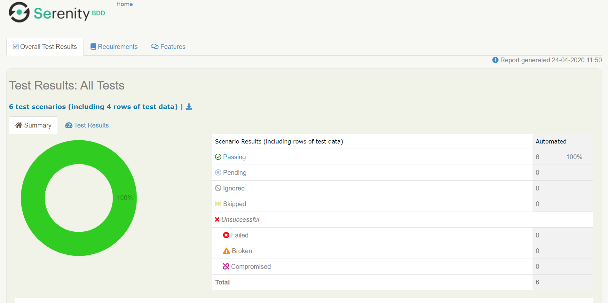
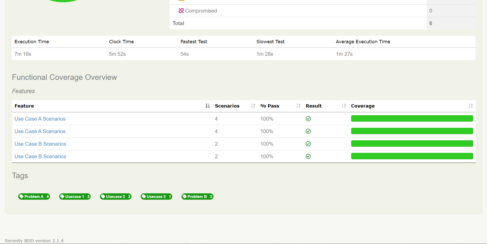
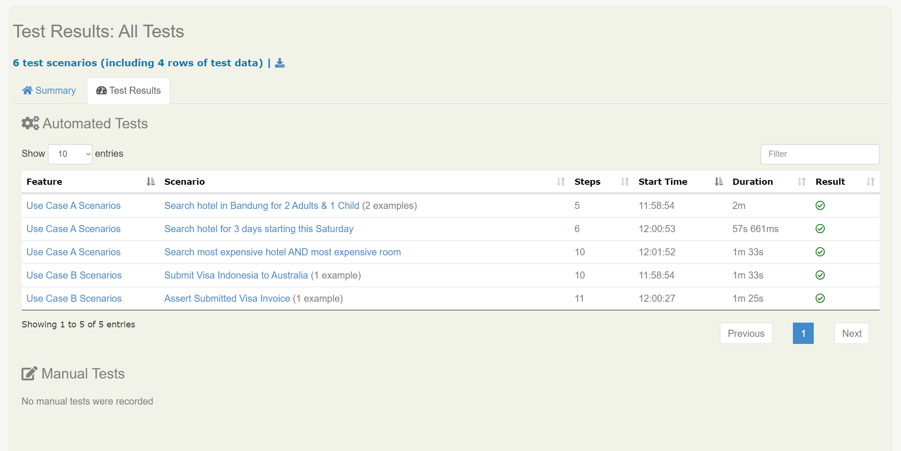
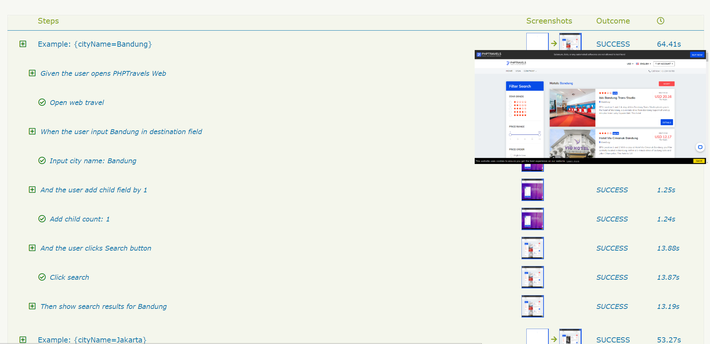

# Sinbad SDET Assignment - Dudi Adikarya

I decided to use Cucumber Java with Serenity for this SDET Assignment.

### Prerequisites:

- Java 1.8
- Maven 3.5.2
- IntelliJ IDEA or other Text Editor
- Chromedriver 81.0 (Depends on your Chrome Version)

### Get Started:
Clone this project repository into your local:
```sh
$ git clone https://github.com/dudiadikaryaa/sinbad-test-dudi.git
```

After you have successfully cloned this project repository, do the following:

```sh
$ mvn install
```

### How to Run:

```sh
$ mvn clean verify                                          | Run all test & generate Test Report
$ mvn clean verify -Dcucumber.options="--tags @tag"         | Run only @tag & generate Test Report
```

### About the Assessment Test:
I decided to make a feature file for each problem, and I made 1 Test Scenarios for each Use Case. So, there're total of 5 Scenarios (one of it is Scenario Outline with 2 examples).

For the **Must Have [Required]** section of the Assessment:

1. I've parameterize the city name in order to be able to search for multiple different city, not only that, I've also parameterize some input too like check-in date, check-out date, etc. You can see the following code in the feature file inside `./test/java/resources/features/` . Here's one of the example:
    
   ```gherkin
    @usecase_1
      Scenario Outline: Search hotel in Bandung for 2 Adults & 1 Child
        Given the user opens PHPTravels Web
        When the user input <cityName> in destination field   #this is the parameterized code
        And the user add child field by 1
        And the user clicks Search button
        Then show search results for <cityName>
        Examples:
        | cityName    |
        | Bandung     |
        | Jakarta     |
   ```
   
   Defined into:
   
   ```java
    @When("the user input {word} in destination field")
    public void userInputCityDestination(String cityName){
           problemASteps.inputCityName(cityName);
    }
    ```
   
2. I've implemented `Serenity` as the reporting framework, when you run the test with `mvn clean verify` it will automatically generate the Test Report for you. You can find the Test Report inside `target/site/serenity/index.html` after you've finished running the test. Here are some of the screenshots from the Test Report that I've generated from this project:

    
    
    
    
    
    
    

---

For the **Good to Have [Optional]** section of the Assessment:
1. I've added the setup option to run the test case in parallel as a default setup in this project. You can the configuration script in the `pom.xml` file, to be exact, in this line of code:
    ```xml
               <plugin>
                    <artifactId>maven-failsafe-plugin</artifactId>
                    <version>2.22.1</version>
                    <configuration>
                        <includes>
                            <include>**/*Suite.java</include>
                        </includes>
                        <argLine>-Xmx512m</argLine>
                        <threadCount>2</threadCount>
                        <parallel>classes</parallel> <!--Here is the specific code to config run in parallel or not-->
                    </configuration>
                    <executions>
                        <execution>
                            <goals>
                                <goal>integration-test</goal>
                                <goal>verify</goal>
                            </goals>
                        </execution>
                    </executions>
                </plugin>
    ```
   
2. I've added the setup to choose which browser do you want to use to run the webview of this automation test. You can find it in the `serenity.properties` file. For the exact code for browser configuration is this code:

   ```sh
   ## Browser specific configuration
   webdriver.driver=chrome
   webdriver.base.url=https://www.phptravels.net/
   ```
   
   > Note that I also put the web base url here so that I dont have to put the web url link inside my code.